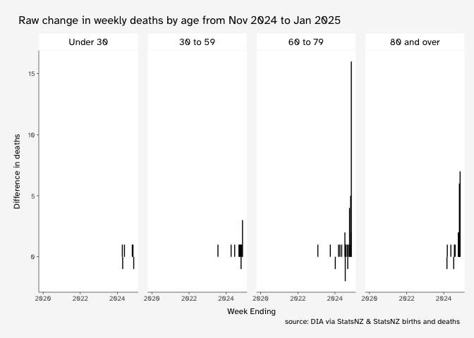

# write up
David Hood

## NZ provisional weekly deaths lag

``` r
library(readr)
library(readxl)
library(dplyr)
library(lubridate)
library(tidyr)
library(ggplot2)
library(ggthemes)
source("~/theme.R")
library(knitr)
```

I was alerted by <https://bsky.app/profile/jeanfisch.bsky.social> that
the lag of provisional weekly New Zealand deaths seemed to have
increased, particularly for younger people.

This is quite possible to have occured- I have seen comments that
various covid data is being standardised to public release on the date
when the death record is finalised, for example *“Note: Due to a change
in the underlying IT systems, deaths attributed to COVID-19 will no
longer be reported with the same recency, and COVID-19 attributed deaths
will now be reported from the Mortality Collections only. This ensures
that deaths have undergone systemic checks and include coronial inquest
findings, which is in line with the reporting of deaths from other
diseases, including other scheduled Notifiable Diseases. From the 17th
of July 2025 only deaths recorded in the Mortality Collection will be
reported as COVID-19 attributed. The most recent data in the Mortality
Collection is for 2022 which is preliminary - more information can be
found on the Mortality Collection webpage.”* from
<https://www.tewhatuora.govt.nz/for-health-professionals/data-and-statistics/covid-19-data/covid-19-current-cases>

But before taking the sensible option, and checking with the DIA about
the context of data production, we can do a thorough breakdown of the
data. I have, siting on my hard drive, a bunch of the weekly death files
that I downloaded at different times. So that provides data for a
completion over time analysis.

## Data

Digging around, I seem to have (noting creation date may not be reliable
from copying files between machines, but it will all come out in the
weekly readings):

- NZ DIA weekly death data 2024-09-18-12-31-50.xlsx with a created date
  of 2024-11-12 13:36 with a file size of 555 KB

- NZ DIA weekly death data update 2024-09-18-12-31-50.xlsx with a
  created date of 2024-11-12 13:36 with a file size of 143 KB

- NZ DIA weekly death data update 2024-12-03-10-34-28.xlsx with a
  created date of 2024-12-03 11:22 with a file size of 129 KB

- statsnzAPIweeklyDeaths.csv (API no longer available) with a created
  date of 2024-11-12 13:36 with a file size of 938 KB

- covid_19_data_portal_by_age.xlsx (covid data portal no longer
  available) with a created date of 2024-11-14 13:36 with a file size of
  177 KB

- covid_19_data_portal_old.xlsx with a created date of 2024-11-14 13:36
  with a file size of 211 KB

- covid_19_data_portal.xlsx with a created date of 2024-11-14 13:36 with
  a file size of 177 KB

- another covid_19_data_portal_by_age.xlsx with a created date of
  2024-11-12 13:36 with a file size of 212 KB

- Provisional-weekly-deaths-registered-in-New-Zealand-from-9-Jan-2000-26-Jan-2025.xlsx
  (these spreadsheets from the StatsNZ Births and Deaths webpage
  releases) with a created date of 2025-02-18 20:10 with a file size of
  716 KB

- provisional-weekly-deaths-registered-in-New-Zealand-from-9-January-2000-20-April-2025.xlsx
  with a created date of 2025-02-15 12:54 with a file size of 738 KB

- provisional-weekly-deaths-registered-in-new-zealand-9-january-2000-27-july-2025.xlsx
  with a created date of 2025-08-19 11:21 with a file size of 743 KB

In practice, one can read in each file and check the date range in the
deaths by age information.

### DIA via StatNZ files

The DIA via StatsNZ files stem from where I was getting data sent
directly to me from StatsNZ during the period after the closure of the
covid data portal and before the weekly data was available on the
quarterly Births and Deaths webpage.

``` r
DIA1 <- read_excel("data/NZ DIA weekly death data 2024-09-18-12-31-50.xlsx", guess_max = 20000, sheet="data") |> filter(ResourceID == "CPWEE1") |> 
  mutate(week_ending = ymd(Period))
range(DIA1$week_ending)
```

    [1] "2011-01-02" "2024-09-01"

The DIA files were in a fairly ad-hoc period where information in weeks
in the update files superceeded the 2024-09-18-12-31-50 original file.

``` r
DIA2 <- read_excel("data/NZ DIA weekly death data update 2024-09-18-12-31-50.xlsx", guess_max = 20000, sheet="data") |> filter(ResourceID == "CPWEE1") |> 
  mutate(week_ending = ymd(Period))
range(DIA2$week_ending)
```

    [1] "2020-01-05" "2024-09-01"

``` r
DIA3 <- read_excel("data/NZ DIA weekly death data update 2024-12-03-10-34-28.xlsx", guess_max = 20000, sheet="data") |> filter(ResourceID == "CPWEE1") |> 
  mutate(week_ending = ymd(Period))
range(DIA3$week_ending)
```

    [1] "2020-01-05" "2024-11-17"

As I do not know about when the 2011 to 2024 was updated prior to the 18
of September update, I am just going to compare the two updates covering
the period since 2020 (excluding the most recent weeks only in the later
update).

``` r
combo <- inner_join(
  DIA2 |> select(week_ending, Label1, Sep2024 = Value),
  DIA3 |> select(week_ending, Label1, Nov2024 = Value),
  by = join_by(week_ending, Label1)) |> 
  filter(Label1 != "Total") |> 
  mutate(raw_added = Nov2024 - Sep2024,
         percent_added = 100 * Nov2024/Sep2024 - 100,
         Label1 = factor(Label1, levels=c("Under 30", "30 to 59",
                                          "60 to 79", "80 and over"))) 

ggplot(combo, aes(x=week_ending, y=raw_added, xend=week_ending)) +
  geom_segment(yend=0) + facet_wrap(~Label1, nrow=1) +
  theme_davidhood() +
  labs(title="Raw change in weekly deaths by age from Sep 2024 to Nov 2024",
       y="Difference in deaths", x="Week Ending", caption="source: DIA via StatsNZ")
```


Between Sep and Nov 2024 there were no changes made prior to 2023. The
most recent 4 weeks (so approximately 6 weeks prior to collation and
publication) in the time series are highly unsettled, containing most of
the late reports. In particular the last 2 weeks of data (4 weeks prior
to publication) show large amounts of change.

Many of the changes older than 4 weeks look to be a change involving a
reduction by one in deaths for one week and an increase by the same
amount in another week (often an adjacent one). These changes mostly
look like revisions in the time details (if with the night of a week
border) or date (if a longer period) details of the death.

### StatsNZ API

Weekly mortality information was available via an API call to StatsNZ
during the same period the covid data portal was available (there was, I
understand, some shared underlying technology). I used to mainly use the
API for automation reasons, and fall back to manual downloads from the
covid data portal on occasions it was unavailable. So, I think it likely
this download is from late in the API’s existence, as I was replacing
old downloads with more recent ones.

``` r
API1 <- read_csv("data/statsnzAPIweeklyDeaths.csv",
                 show_col_types = FALSE) |> 
  select(week_ending = Period, Label1, Value)
```

    New names:
    • `` -> `...1`

``` r
range(API1$week_ending)
```

    [1] "2000-01-09" "2024-07-21"

This is consistent with the most recent weeks in the data being mid-late
July 2024, suggesting a compilation date of late July or early August.
With the DIA Sep 2024 update have about 5 weeks additional data, that
difference makes for a useful comparison.

``` r
combo <- inner_join(
  API1 |> select(week_ending, Label1, Jul2024 = Value),
  DIA2 |> select(week_ending, Label1, Sep2024 = Value),
  by = join_by(week_ending, Label1)) |> 
  filter(Label1 != "Total") |> 
  mutate(raw_added = Sep2024 - Jul2024,
         percent_added = 100 * Sep2024/Jul2024 - 100,
         Label1 = factor(Label1, levels=c("Under 30", "30 to 59",
                                          "60 to 79", "80 and over"))) 

ggplot(combo, aes(x=week_ending, y=raw_added, xend=week_ending)) +
  geom_segment(yend=0) + facet_wrap(~Label1, nrow=1) +
  theme_davidhood() +
  labs(title="Raw change in weekly deaths by age from Jul 2024 to Sep 2024",
       y="Difference in deaths", x="Week Ending", caption="source: DIA via StatsNZ & StatsNZ API")
```


The (late) July to September lag pattern is pretty much the same as seen
in the DIA steps.

### Covid Data Portal

For the covid data portal files the first step is to confirm if the
similarly sized files are the same.

``` r
cdp177a <- read_excel("data/covid_19_data_portal_by_age.xlsx",
                      sheet="data")
cdp177b <- read_excel("data/covid_19_data_portal.xlsx",
                      sheet="data")
cdp211 <- read_excel("data/covid_19_data_portal_old.xlsx",
                      sheet="data") |> 
  mutate(week_ending = as.Date(Period))
cdp212 <- read_excel("data/covid_19_data_portal_by_age_212.xlsx",
                      sheet="data")
all(cdp177a$Period == cdp177b$Period)
```

    [1] TRUE

``` r
all(cdp177a$Value == cdp177b$Value)
```

    [1] TRUE

``` r
all(cdp211$Period == cdp212$Period) 
```

    Warning in cdp211$Period == cdp212$Period: longer object length is not a
    multiple of shorter object length

    [1] FALSE

The two 177 KB covid portal downloads seem the same (same dates and
values), but the 211 KB ans 212KB files are different. This gives us 3
snapshots to explore.

``` r
range(cdp177a$Period)
```

    [1] "2000-01-09" "2024-07-21"

The 177 file is the same date range as the last API download I have, so
was likely prompted by news of the API shutdown, and since I have
tackled the APi version already, this doesn’t need more action.

``` r
range(cdp211$Period)
```

    [1] "2000-01-09" "2024-06-23"

``` r
range(cdp212$Period)
```

    [1] "2000-01-09" "2024-07-28"

The 212 file contains a weeks worth more data than the API gathered
file, which I think is not enough difference to focus on.

The 211 file contains data to 23rd of June 2024, so is about a month
earlier than the API gather file.

``` r
combo <- inner_join(
  cdp211 |> select(week_ending, Label1, Jun2024 = Value),
  API1 |> select(week_ending, Label1, Jul2024 = Value),
  by = join_by(week_ending, Label1)) |> 
  filter(Label1 != "Total") |> 
  mutate(raw_added = Jul2024 - Jun2024,
         percent_added = 100 * Jul2024/Jun2024 - 100,
         Label1 = factor(Label1, levels=c("Under 30", "30 to 59",
                                          "60 to 79", "80 and over"))) 

ggplot(combo, aes(x=week_ending, y=raw_added, xend=week_ending)) +
  geom_segment(yend=0) + facet_wrap(~Label1, nrow=1) +
  theme_davidhood() +
  labs(title="Raw change in weekly deaths by age from Jun 2024 to Jul 2024",
       y="Difference in deaths", x="Week Ending", caption="source: DIA via StatsNZ & StatsNZ API")
```


Over this monthly period it is only the last 4 week instability in the
figures. No historical revisions.

### Births and Deaths

And that gets us to the modern home of weekly data, the quarterly
released weekly data from the Births and Deaths webpage (this was where
the ad-hoc data I was being supplied was expected to have a public home,
and it eventualy did).

``` r
BD25_1 <- read_excel("data/Provisional-weekly-deaths-registered-in-New-Zealand-from-9-Jan-2000-26-Jan-2025.xlsx", sheet="data", guess_max = 26000)
BD25_4 <- read_excel("data/provisional-weekly-deaths-registered-in-New-Zealand-from-9-January-2000-20-April-2025.xlsx", sheet="data", guess_max = 26000)
BD25_7 <- read_excel("data/provisional-weekly-deaths-registered-in-new-zealand-9-january-2000-27-july-2025.xlsx", sheet="data", guess_max = 26000)
```

The DIA file from mid November 2024 is the nearest preceding file to the
first Births and Deaths file.

``` r
combo <- inner_join(
  DIA3 |> select(week_ending, Label1, Nov2024 = Value),
  BD25_1 |> filter(ResourceID == "CPWEE1") |> 
    mutate(week_ending = as.Date(Period)) |> 
    select(week_ending, Label1, Jan2025 = Value),
  by = join_by(week_ending, Label1)) |> 
  filter(Label1 != "Total") |> 
  mutate(raw_added = Jan2025 - Nov2024,
         percent_added = 100 * Jan2025/Nov2024 - 100,
         Label1 = factor(Label1, levels=c("Under 30", "30 to 59",
                                          "60 to 79", "80 and over"))) 

ggplot(combo, aes(x=week_ending, y=raw_added, xend=week_ending)) +
  geom_segment(yend=0) + facet_wrap(~Label1, nrow=1) +
  theme_davidhood() +
  labs(title="Raw change in weekly deaths by age from Nov 2024 to Jan 2025",
       y="Difference in deaths", x="Week Ending", caption="source: DIA via StatsNZ & StatsNZ births and deaths")
```



The November 2024 data, as reviewed from the January 2025 pattern is
lokking similar in stile to earlier steps.

``` r
combo <- inner_join(
  BD25_1 |> filter(ResourceID == "CPWEE1") |> 
    mutate(week_ending = as.Date(Period)) |> 
    select(week_ending, Label1, Jan2025 = Value),
  BD25_4 |> filter(ResourceID == "CPWEE1") |> 
    mutate(week_ending = as.Date(Period)) |> 
    select(week_ending, Label1, Apr2025 = Value),
  by = join_by(week_ending, Label1)) |> 
  filter(Label1 != "Total") |> 
  mutate(raw_added = Apr2025 - Jan2025,
         percent_added = 100 * Apr2025/Jan2025 - 100,
         Label1 = factor(Label1, levels=c("Under 30", "30 to 59",
                                          "60 to 79", "80 and over"))) 

ggplot(combo, aes(x=week_ending, y=raw_added, xend=week_ending)) +
  geom_segment(yend=0) + facet_wrap(~Label1, nrow=1) +
  theme_davidhood() +
  labs(title="Raw change in weekly deaths by age from Jan 2025 to Apr 2025",
       y="Difference in deaths", x="Week Ending", caption="source: DIA via StatsNZ & StatsNZ births and deaths")
```


Comparing the April release with January, there are completeness/lag
increases for the last 3 weeks, but no older revisions in the data.

``` r
combo <- inner_join(
  BD25_4 |> filter(ResourceID == "CPWEE1") |> 
    mutate(week_ending = as.Date(Period)) |> 
    select(week_ending, Label1, Apr2025 = Value),
  BD25_7 |> filter(ResourceID == "CPWEE1") |> 
    mutate(week_ending = as.Date(Period)) |> 
    select(week_ending, Label1, Jul2025 = Value),
  by = join_by(week_ending, Label1)) |> 
  filter(Label1 != "Total") |> 
  mutate(raw_added = Jul2025 - Apr2025,
         percent_added = 100 * Jul2025/Apr2025 - 100,
         Label1 = factor(Label1, levels=c("Under 30", "30 to 59",
                                          "60 to 79", "80 and over"))) 

ggplot(combo, aes(x=week_ending, y=raw_added, xend=week_ending)) +
  geom_segment(yend=0) + facet_wrap(~Label1, nrow=1) +
  theme_davidhood() +
  labs(title="Raw change in weekly deaths by age from Apr 2025 to Jul 2025",
       y="Difference in deaths", x="Week Ending", caption="source: DIA via StatsNZ & StatsNZ births and deaths")
```


Comparing the July release with April, again there are immediate
completeness additions but no older revisions. From this alone we don’t
know if initial reporting has gotten better, or if revision of older
entries is not being updated as often.

The footnotes of the Weekly death data aren’t conclusive either, noting:

1.  Weekly deaths data are based on date of death and differ from other
    deaths statistics based on date of registration. These data are
    provisional and subject to revision during the full process of
    producing death statistics.
2.  Totals are by date of death, week ending Sunday.
3.  Weekly totals will differ from those in the death registrations time
    series as deaths are registered at the time of burial or cremation
    of the body.
4.  An average of five percent of deaths are registered two weeks or
    more after date of death. Therefore weekly totals are expected to
    increase over time as death registrations are submitted and
    processed.
5.  Excluded are overseas addresses or where location could not be
    determined, and records where the person’s sex is missing or not in
    either male or female category, as these numbers are too low to
    publish a weekly total.
6.  The accuracy of any administrative data, which includes but is not
    limited to address information, is subject to human error.
7.  The data provided have been collated to the best of our ability and
    may have a small variance to alternative publications.

### Infoshare

Another source of Date of Death information, but only for total
population is https://infoshare.stats.govt.nz in Population ; Deaths -
VSD ; Table: Month and year of death (Monthly) which has the footnote
“Deaths data are based on deaths registered in New Zealand to people
resident in New Zealand by date of death (not date of registration).
Data from 1990 are subject to revision. Data has been randomly rounded
to protect confidentiality. Individual figures may not add up to totals,
and values for the same data may vary in different tables.”

But even if it is not identical data, we can take advantage of the
timing that the month June 2020 both had a weekly period begin on the
1st, and run forwards the cumulative totals.

``` r
VSD <- read_csv("data/VSD349801_20250908_093545_1.csv", skip=1, n_max = 543) |> 
  mutate(week_ending = as.Date(paste0(gsub("M", "-", `...1`),"-15")),
         Series="Monthly") |> 
  filter(week_ending > as.Date("2020-06-01")) |> 
  select(week_ending, Series, Deaths= `Total Both Sexes`)
```

    New names:
    Rows: 543 Columns: 2
    ── Column specification
    ──────────────────────────────────────────────────────── Delimiter: "," chr
    (1): ...1 dbl (1): Total Both Sexes
    ℹ Use `spec()` to retrieve the full column specification for this data. ℹ
    Specify the column types or set `show_col_types = FALSE` to quiet this message.
    • `` -> `...1`

``` r
BD25_7  |> mutate(week_ending = as.Date(Period),
         Series="Weekly") |> 
  filter(week_ending > as.Date("2020-06-01"), Label1 == "Total", 
         ResourceID == "CPWEE1") |> 
  select(week_ending, Series, Deaths= Value) |> 
  bind_rows(VSD) |> 
  arrange(Series, week_ending) |> 
  group_by(Series) |> 
  mutate(cumuDeath = cumsum(Deaths)) |> 
  ggplot(aes(x=week_ending, y=cumuDeath, colour=Series)) +geom_line() +
  scale_colour_colorblind() + theme_davidhood()
```


So… We can at least say, given that there is random rounding going on,
that the weekly data (in total) looks stable in relation to the monthly
source, and the difference looks to be fairly constant over time (the
ratio of the two seems to be stable). We can maybe refine it a little by
inferring the cumulative total at end of month within the weekly data
and matching it the monthly data as a percentage. But that is not going
to tell me more about any reporting lag nor I suspect be very useful in
relation to the rounding effects, so I will pass on doing so for the
moment (I am just noting it is possible as an exercise to the reader)

# the monthly by age and ethnicity data.

The quarterly release of births and deaths, where the weekly provisional
is now housed, also has monthly data. See
https://www.stats.govt.nz/information-releases/?dateFiltersID=10&filters=Births%20and%20deaths&start=0

This is an easy to access dataset for looking at lag as you can go back
through older releases to get the monthly data from that time. The data
has a longer time to publication than the provisional data (for example
the Year ended June 2025 data was published in August 19th, so with a
approximately 7 week compilation delay compared to the 2 week or so for
the provisional weekly (so we would expect it to normally be largely
complete for record entry)).

The catchment is again different, being the randomly rounded data of
everyone who died in New Zealand by month of registration (disposal of
body), regardless of residence. this makes this data hard to use for
rates as the number of non-resident people present in a particular month
is not at all easy to work out.

But it does offer an easy pathway for analysis by comparing the counts
(by age) between different publications of the same data.

``` r
filelist <- list.files("data/", pattern="^[mM]onthly-death")
recency <- gsub(".*2010-", "",filelist)
dated <- dmy(paste(15,gsub("\\.xlsx","",recency)))
metadata <- data.frame(filelist,
                       toDate = gsub("\\.xlsx","",recency),
                       dated) |> arrange(dated)

sequcompare <- function(x, metaref = metadata){
  file1 <- metaref$filelist[x-1]
  file2 <- metaref$filelist[x]
  #read in and compare...
  setA <- read_excel(paste0("data/",file1), sheet="Data") |> 
    rename(YR = 1, Mn = 2, Eth = 3, Sex = 4, Age = 5, Dth = 6) |> 
    filter(Eth == "Total")|> 
    mutate(low_age = as.numeric(substr(Age,1,2)),
           groupage = case_when(low_age < 30 ~ "Under 30",
                                low_age < 60 ~ "30 to 59",
                                low_age < 80 ~ "60 to 79",
                                TRUE ~ "80+"),
           asAt = as.Date(paste(YR, Mn,"15", sep="-"))) |> 
    summarise(.by=c(asAt,groupage),
              release1st = sum(Dth))
  setB <- read_excel(paste0("data/",file2), sheet="Data") |> 
    rename(YR = 1, Mn = 2, Eth = 3, Sex = 4, Age = 5, Dth = 6) |> 
    filter(Eth == "Total")|> 
    mutate(low_age = as.numeric(substr(Age,1,2)),
           groupage = case_when(low_age < 30 ~ "Under 30",
                                low_age < 60 ~ "30 to 59",
                                low_age < 80 ~ "60 to 79",
                                TRUE ~ "80+"),
           asAt = as.Date(paste(YR, Mn,"15", sep="-"))) |> 
    summarise(.by=c(asAt,groupage),
              release2nd = sum(Dth))
  combo <- inner_join(setA,setB, by = join_by(asAt, groupage)) |> 
    mutate(raw_added = release2nd - release1st) |> 
    filter(year(asAt) > 2018)
  nettAdditions = sum((combo$raw_added))
  moves = (sum(abs(combo$raw_added))- nettAdditions)/2
  output = data.frame(SetAdate = metaref$dated[x-1],
                      nettAdditions,moves)
  return(output)
}

resultsList <- lapply(2:nrow(metadata), sequcompare)
resultsDF <- bind_rows(resultsList) |> 
  mutate(When = paste("to", month(SetAdate, label=TRUE), year(SetAdate)),
         `compared to` = paste("to", month(SetAdate + days(90), label=TRUE), year(SetAdate + days(90)))) |> 
  select(When, `compared to`, Additions=nettAdditions, Moves=moves)
knitr::kable(resultsDF)
```

| When        | compared to | Additions | Moves |
|:------------|:------------|----------:|------:|
| to Jun 2021 | to Sep 2021 |         0 |     0 |
| to Sep 2021 | to Dec 2021 |         0 |     0 |
| to Dec 2021 | to Mar 2022 |         0 |     0 |
| to Mar 2022 | to Jun 2022 |        15 |   330 |
| to Jun 2022 | to Sep 2022 |         0 |     0 |
| to Sep 2022 | to Dec 2022 |         0 |     0 |
| to Dec 2022 | to Mar 2023 |         0 |     0 |
| to Mar 2023 | to Jun 2023 |         0 |     0 |
| to Jun 2023 | to Sep 2023 |         0 |     0 |
| to Sep 2023 | to Dec 2023 |         0 |     0 |
| to Dec 2023 | to Mar 2024 |         0 |     0 |
| to Mar 2024 | to Jun 2024 |         0 |     0 |
| to Jun 2024 | to Sep 2024 |         0 |     0 |
| to Sep 2024 | to Dec 2024 |         0 |     0 |
| to Dec 2024 | to Mar 2025 |         0 |     0 |
| to Mar 2025 | to Jun 2025 |         0 |     0 |

This broadly shows, with the longer period before publication, it avoids
the lag changes seen in the weekly data. But also, something happened
between the totals in the “to March 2022” monthly file and the “to June
2022” file.

There was a 15 higher nett total of deaths, and 330 changes that could
be the result of movements between categories or months (675 numerical
changes in total). This could be publication of a major revision, but it
could also be redoing the random rounding. But either way it doesn’t
actually have much effect on overall trends.
